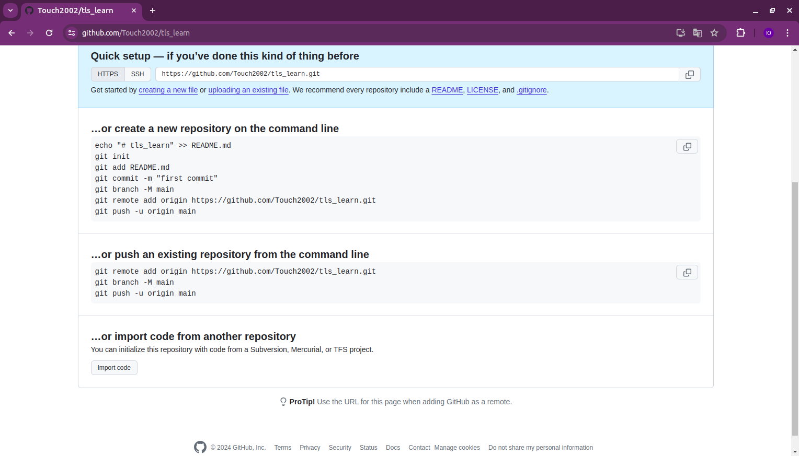

# tls_learn
спочатку потрібно додати readme файл до репозиторію
щоб переконатися що все працює, по скріну нижче 
показано команди які потрібно виконати.


тобто я тупо скопіював команду і вбив в термінал
````
echo "# tls_learn" >> README.md
git init
git add README.md
git commit -m "first commit"
git branch -M main
git remote add origin https://github.com/Touch2002/tls_learn.git
git push -u origin main
````
Після виконання команди отримав такий вивід

За [посиланням](https://docs.github.com/en/authentication/troubleshooting-ssh/error-permission-denied-publickey),
першою командою я перевіряю чи був закритий ssh ключ згенерований раніше.
````
ssh-add -l -E sha256
````

Тепер переконуюсь що ssh приєднано до облікового запису

Запускаю агент ssh в фоновому режимі
````
eval "$(ssh-agent -s)"
````
Маю такий вивід

Знаходжу відбиток приватного ключа
````
ssh-add -l -E md5
````
Або
````
ssh-add -l
````
Отримав такий вивід


Так як результат не є очікуваним це можна вважати помилкою. Покищо це пропущу
і перейду за посиланням в якому пояснюється як ["Додати свій ключ SSH до github"](https://docs.github.com/en/authentication/troubleshooting-ssh/error-permission-denied-publickey),
після перечитання я просто поіншому гугланув і знайшов [статтю](https://docs.github.com/en/authentication/connecting-to-github-with-ssh/adding-a-new-ssh-key-to-your-github-account),
там є команда
````
cat ~/.ssh/id_ed25519.pub
````

закинув відкритий ключ в свій профіль

Тепер начебто повинно працювати роблю пуш отримав такий вивід
![alt]