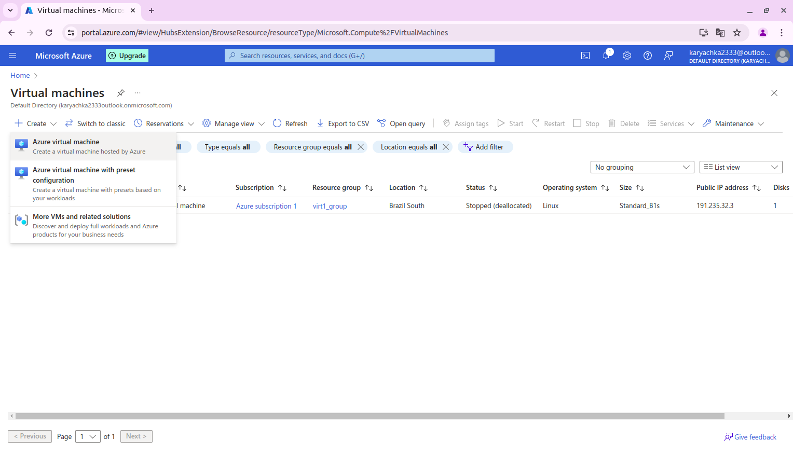
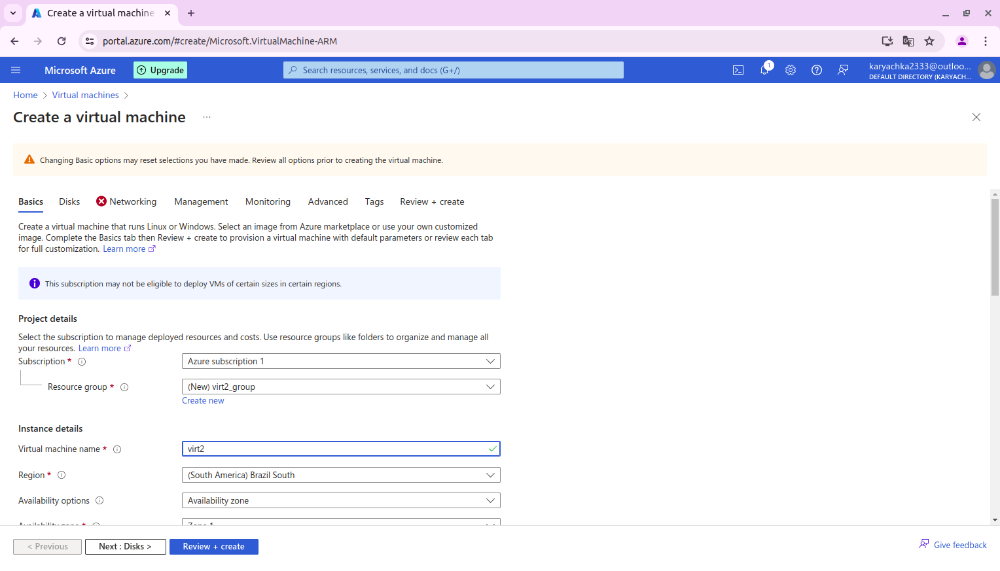
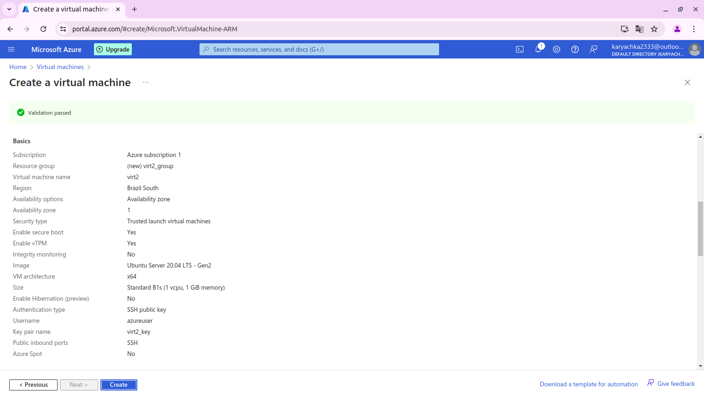
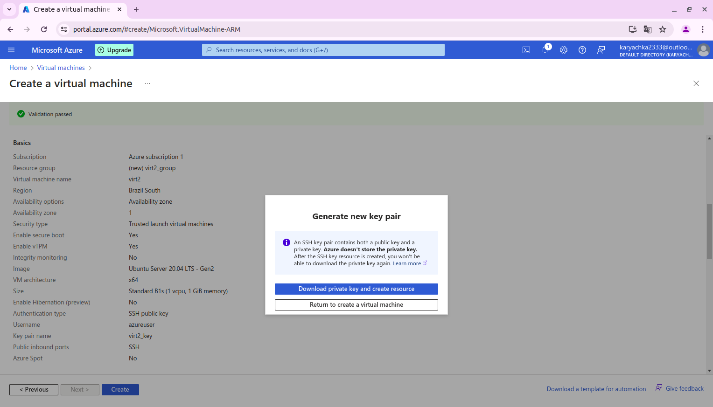
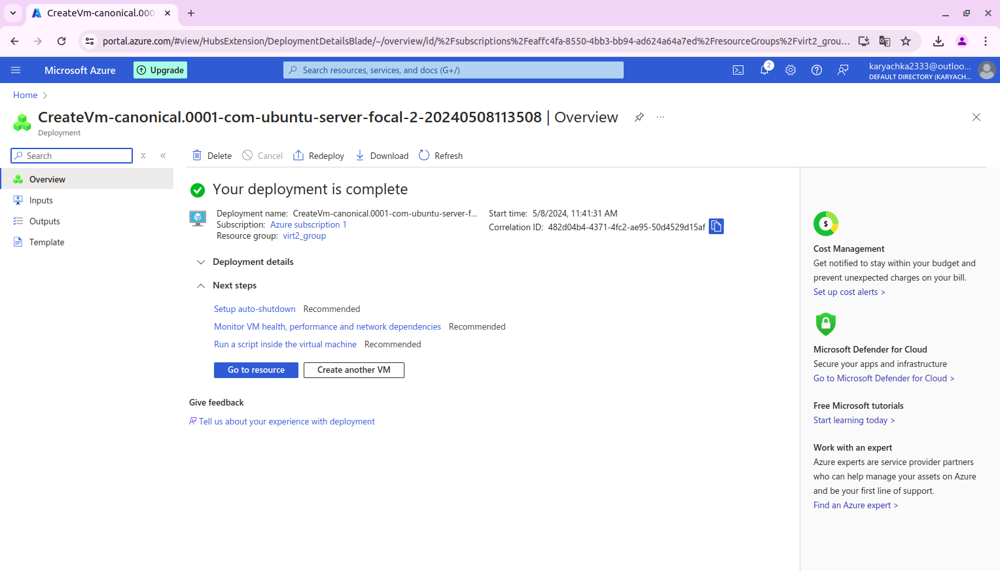

## Як створити віртуальну машину azure
Стосовно реєстрації облікового запису, я не зміг зареєструвати обліковий запис
з безкоштовною підпискою. Для того щоб обдурити майкрософт я створював акаунт на комп'ютері
на якому ніколи не було azure, з увімкненим vpn вигаданими обліковими даними, телефоном
який ніколи не реєстрував і з щойно створеної пошти outlook. Також я використовував
нові дані картки яку я створив в приват24. Я вважаю воно розуміє що це я тому що
банк ділиться з майкрософт моїми даними. Тому тут описано тільки як створити віртуальну машину.
1. Переходжу на портал [azure](https://portal.azure.com/#view/HubsExtension/BrowseResource/resourceType/Microsoft.Compute%2FVirtualMachines)
2. Натискаю кнопку create, далі натискаю "Azure virtual machine"

3. Далі вписую ім'я віртуальної машини в моєму випадку "virt2"

4. Далі натискаю "review+create"

5. Далі azure пропонує згенерувати пару ключів ssh, погоджуємось і завантажуємо

6. Тепер чекаємо поки не з'явиться повідомлення нижче і натискаємо "Go to resource"

## Підключення до віртуальної машини
Щоб це зробити для початку її потрібно запустити на порталі azure.

1.1. Переходимо на портал до [віртуальних машин](https://portal.azure.com/#view/HubsExtension/BrowseResource/resourceType/Microsoft.Compute%2FVirtualMachines).

Ми маємо побачити дану вкладку з переліком віртуальних машин:

Натискаємо на назву машини яку хочемо запустити. Після цього натискаємо кнопку start.
(Можливо потрібно декілька разів натиснути)

Далі йдемо по інструкції як підключитись по ssh за допомогою [putty](putty.md).