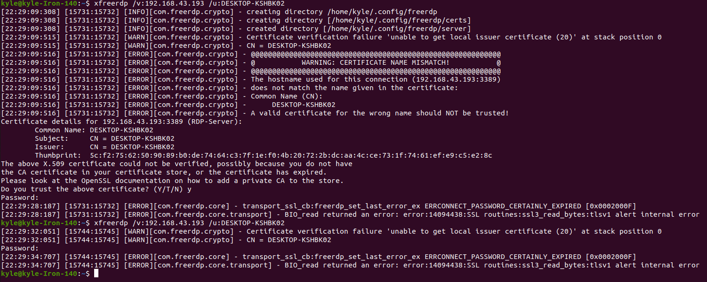
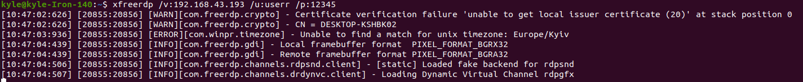

# Підключення до віндовс з лінукса по rdp.
Щоб це зробити я хочу використовувати програми в яких не потрібна
реєстрація. Початкову інформацію я візму з курсу на [hackthebox](https://academy.hackthebox.com/module/49/section/454).
Я переглянув [статтю](https://learn.microsoft.com/ru-ru/windows-server/remote/remote-desktop-services/clients/remote-desktop-allow-access) повторюючи кроки і зрозумів що віддалений робочий стіл вже
ввімкнуто. Айпі пінгується. Але при конекті виникає помилка.

Знайшов [статтю](https://github.com/FreeRDP/FreeRDP/issues/4444) в якій пояснювалось що повинно оновити вінду.

Я спробував змінити формат команди і все запрацювало.
```
xfreerdp /v:192.168.43.193 /u:userr /p:12345
```
Відкрилося вікно з віндою та в терміналі є такий результат.

