# Отримання ssl-сертифікату
Ціль роботи отримати сертифікат для сайту який розміщений на віртуальній машині azure,
на домені хостингу nic.ua.

По відомим мені даним його можна отримати встановивши certbot на віртуальну машину.
В свою чергу для цього потрібно керувати віртуалкою, я використовуватиму підключення по ssh
за допомогою ключа.

###### 1. Підключення до віртуальної машини
Щоб це зробити для початку її потрібно запустити на порталі azure.

1.1. Переходимо на портал до [віртуальних машин](https://portal.azure.com/#view/HubsExtension/BrowseResource/resourceType/Microsoft.Compute%2FVirtualMachines).

Ми маємо побачити дану вкладку з переліком віртуальних машин:

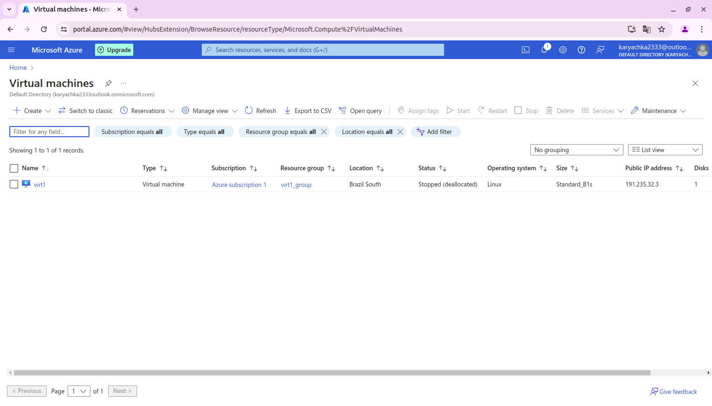

Натискаємо на назву машини яку хочемо запустити. Після цього натискаємо кнопку start.
(Можливо потрібно декілька разів натиснути)

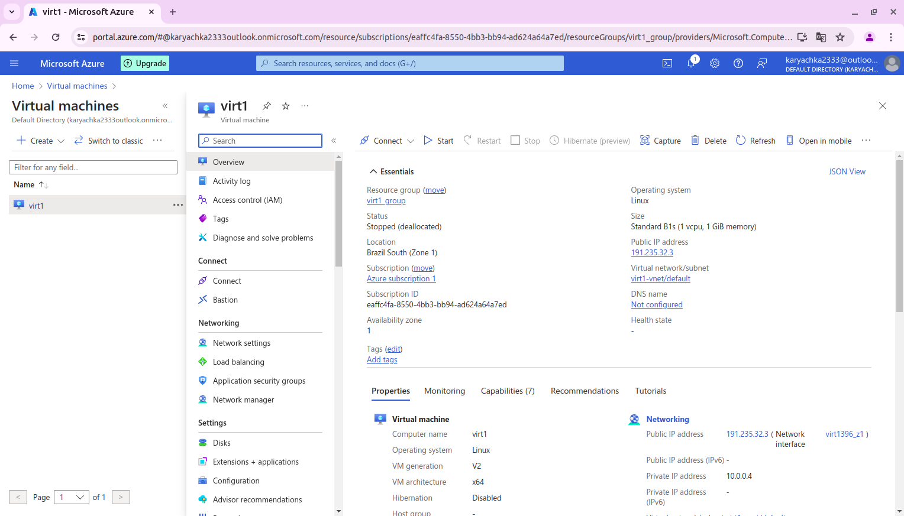

1.2. Підключаємось по ssh

Тут описую варіант для linux ubuntu. Тому я відкриваю термінал і вбиваю команду: (замініть мій айпі та шлях до ключа на свій)
````
ssh -i ~/.ssh/id_rsa.pem azureuser@191.235.32.3
````
Отримуємо такий результат

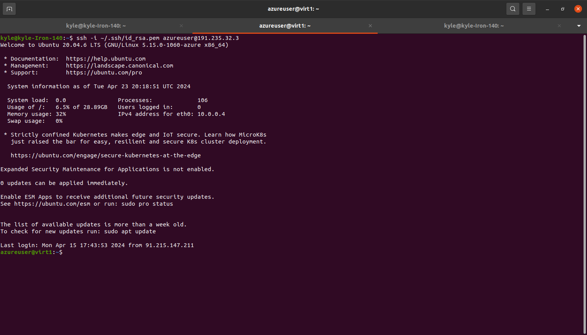

## Що далі, бігаю ро гуглу?
Так як сторінка налаштована, мені потрібно розібратися яким чином можливо його отримати.
[Офіційний сайт](https://letsencrypt.org)

[На офіційному сайти тикаю кнопочку](https://letsencrypt.org/uk/getting-started/),
трохи почитавши розумію що shell access це ssh тому мені потрібено перейти на
сайт [certbot](https://certbot.eff.org/). Тикаю 
["Get Certbot instructions"](https://certbot.eff.org/instructions), 
там потрібно вказати на чому працює сайт в моєму випадку це apache і ubuntu 20, 
і воно таке розумне що воно видало інструкції під мої налаштування. Почитавши і цю статтю починаю виконувати
інструкцію

###### 2. Встановлення certbot
2.1 Перевіряю чи я можу використовувати sudo і вказую що всі подальші команди 
я хочу виконувати як адміністратор. І вводжу команду в термінал.
````
sudo su
````
Отримую такий результат
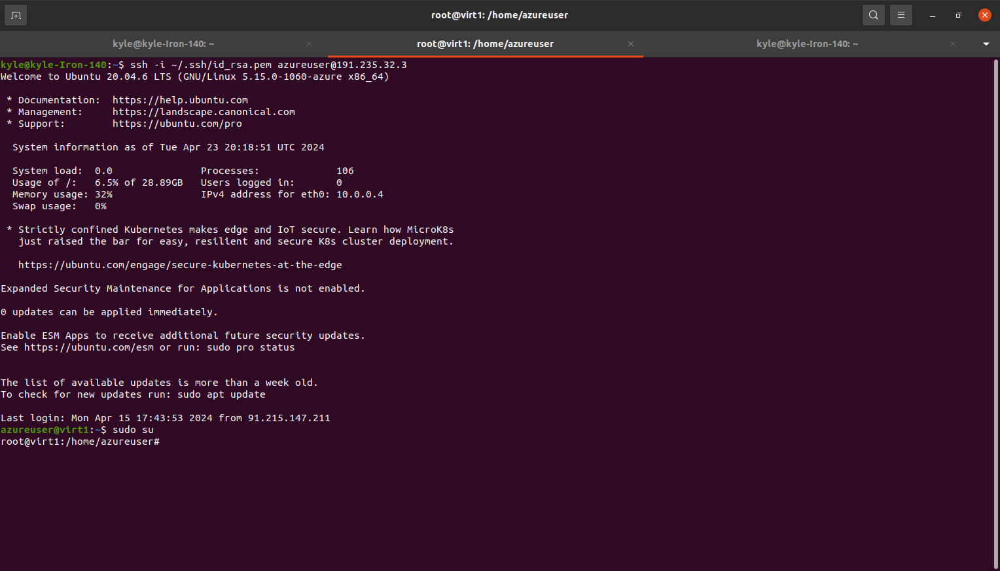

2.2 Встановлюю snapd

Навіть якщо він в мене встановленний помилок виникнути не повинно, вводжу команди. (Якщо
ви просто копіюєте команди не забудьте що це дві команди тому натисніть enter.)
````
apt update
apt install snapd -y
````

Отримую такий результат, по виводу розумію що цей пакет вже був встановленний
(я очищував термінал бо трохи натупив).
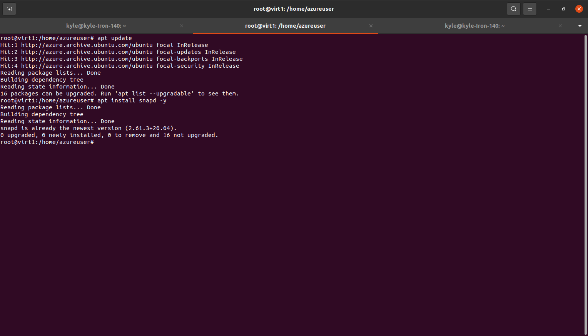

2.3 Встановлюю пакет certbot
````
snap install --classic certbot
````
Отримую такий результат
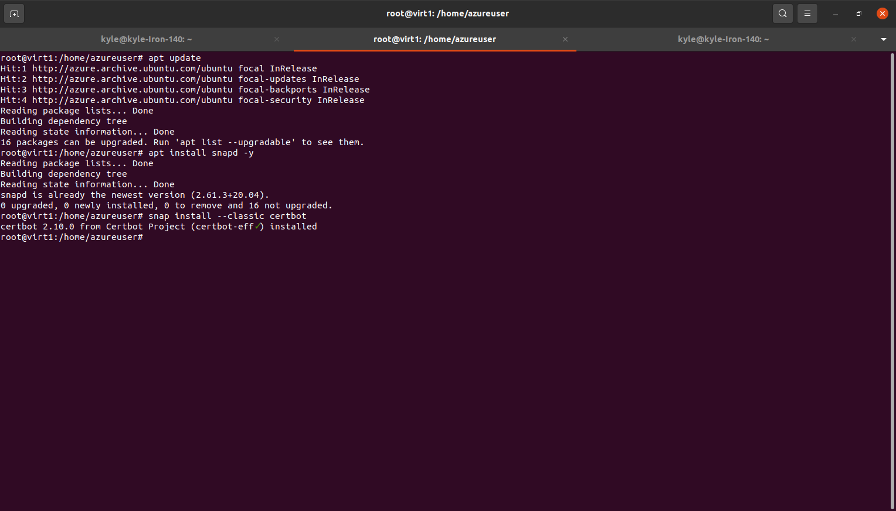

2.4 Перевіряю чи все ок з certbot командою
````
ln -s /snap/bin/certbot /usr/bin/certbot
````
Отримую такий результат (думаю що відсутній вивід це нормально)
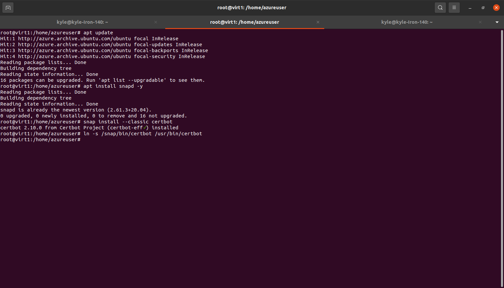
Виконую цю команду, щоб отримати сертифікат і дозволити Certbot автоматично редагувати вашу конфігурацію apache для його обслуговування, увімкнувши доступ HTTPS за один крок.
Після виконання команди certbot попросив вказати електронну пошту я хотів пропустити 
цей варіант і натиснув enter.
````
certbot --apache
````
Отримав такий результат (трюк не проканав)
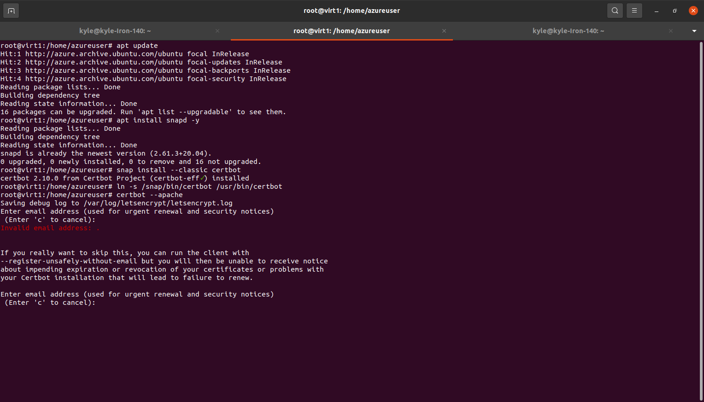
Введу пошту яка не проходила ніякої реєстрації. Після введення пошти в мене виникла 
підозра що це і є реєстрація.

Отримав такий результат
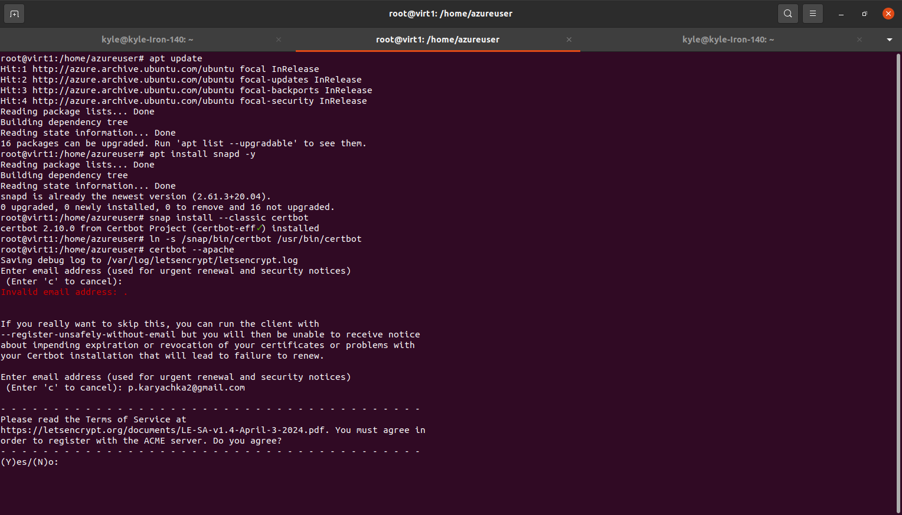
З усім погоджуюсь, поки воно не починає просити ввести ім’я(я) домену(ів), які ви хочете мати у своєму сертифікаті.

Отримав такий результат
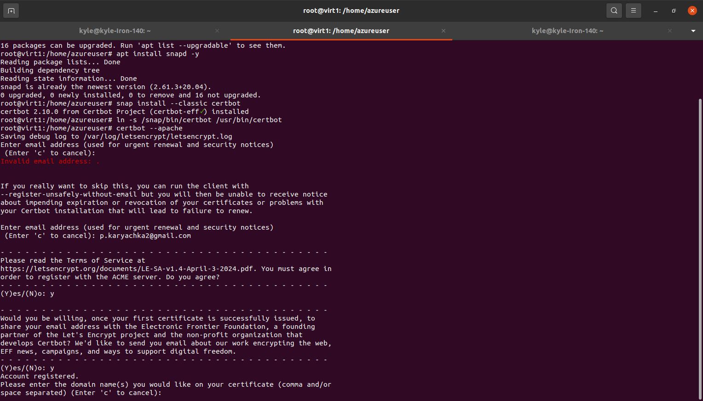
Так як мій початково отриманий домен не безкінечний я спробую вказати крім домену
і айпі віртуалки.

Отримую такий результат (let's encrypt не видає сертифікатів для голої айпі адреси
потрібно повторно ввести домене ім'я після того як підтвердите повторне введення).
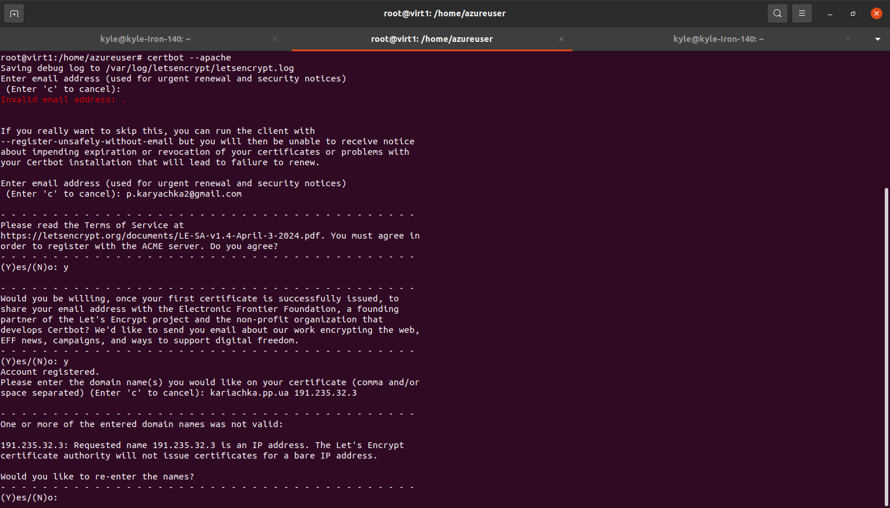

повторно ввівши доменне ім'я отримав такий результат
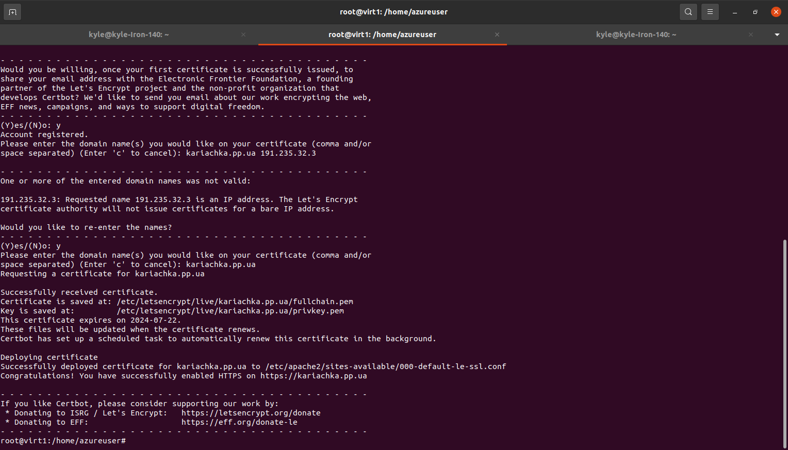

Все ми отримали ссл сертифікат.

# Як підключитись до віртуальної машини по ssh
Спочатку я підключався через ключ ssh через термінал, тепер я опишу як підключитись через
putty в windows. Завантажую putty з офіційного [сайту], я передумав по побачив
вбудований ssh в powershell. Переходжу на портал azure. Знову передумав бо вилітали помилки.
Я завантажив putty з розширенням .msi. Першим кроком треба зайти в шлях
де встановленно программу. потім ми побачимо декілька програм ми відкриваємо щось
з keygen, щоб змінити формат приватного ключа з pem на ppk, 
зберігаємо файл в новому розширенні. Тепер відкриваю программу putty, після
введення айпі, переходжу в connections, ssh, auth, і перше верхнє там є
поле для введення там воно саме верхнє натискаю browse, і вибираю потрібний
раніше створений ppk файл. Потім як логін вводжу "azureuser", і помилок не
виникло на цьому все. Зараз розпишу покрокову інструкцію.
1. Завантажую putty з [офіційного сайту](https://www.chiark.greenend.org.uk/~sgtatham/putty/latest.html),
потрібно завантажити пакет з розширенням .msi
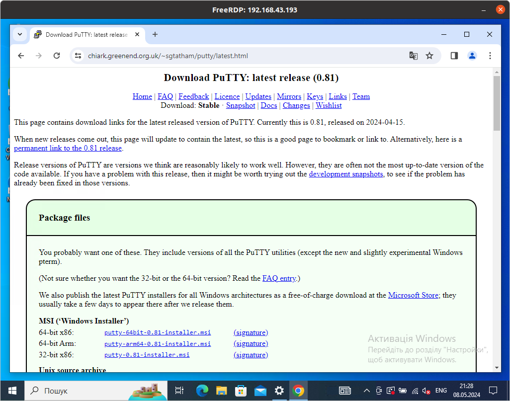
2. Встановити і запам'ятати шлях до програми, перейти в каталог де була встановлена,
программа, для мене це "C:\Program Files\PuTTY". Ви маєте побачити цей набір программ:
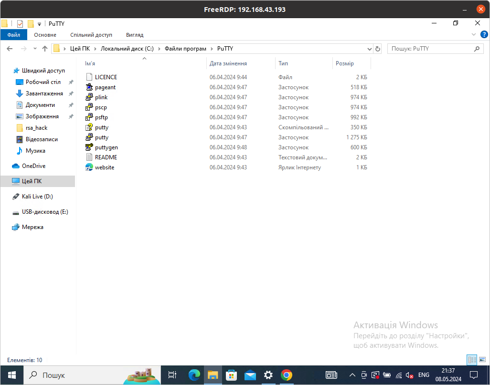
3. Буду вважати що ви вже отримали приватний ключ від віртуалки,
то відкриваємо програму "puttygen" і натискаємо кнопку "Load":
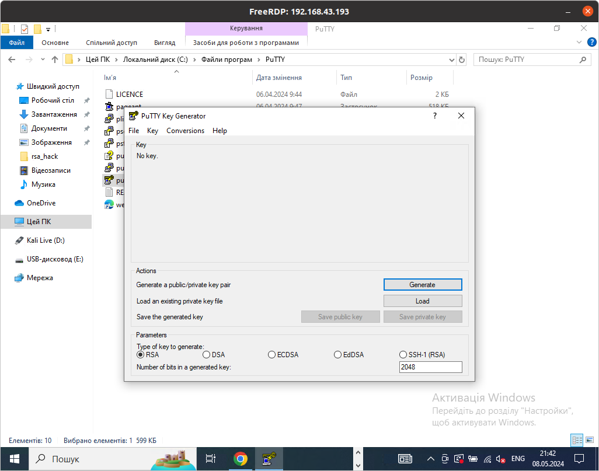
4. Тепер обираємо наш приватний ключ і з'явится ось таке повідомлення:
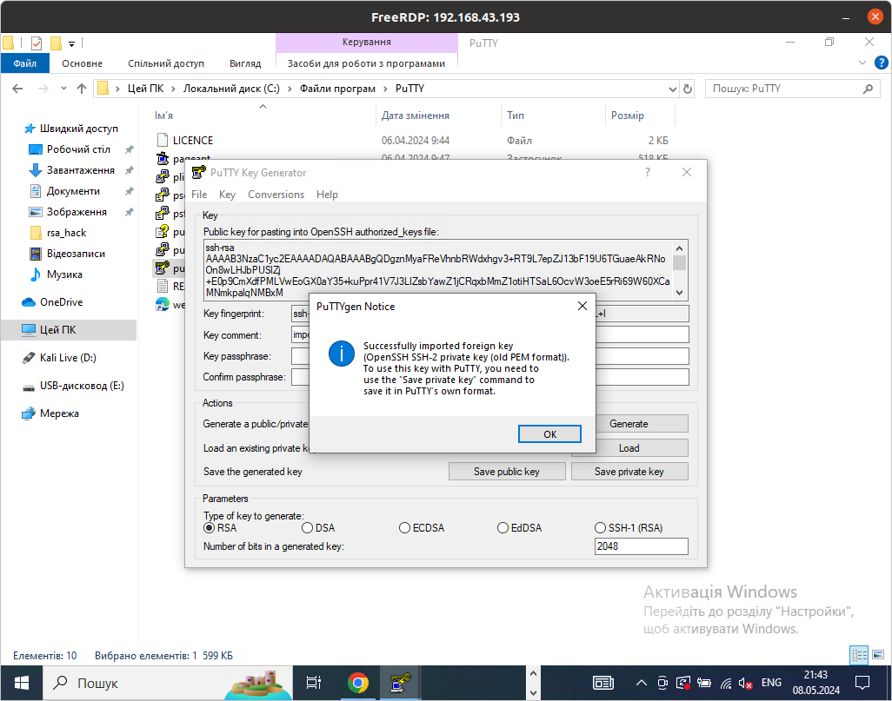
5. Натискаю ок і потім "Save private key".
6. Закриваю цю програму та відкриваю іншу з назвою "putty" (увімкніть віртуалку):

7. В "Host Name" і "Saved Sessions", вводжу айпі адресу віртуальної машини.
8. Тепер по ієрархії спускаюсь до потрібного параметру:
Connections->SSH->Auth->Credentials. Знаходимо параметр "Private key file for authentication",
тисну "Browse" і додаю раніше збережений ключ .ppk
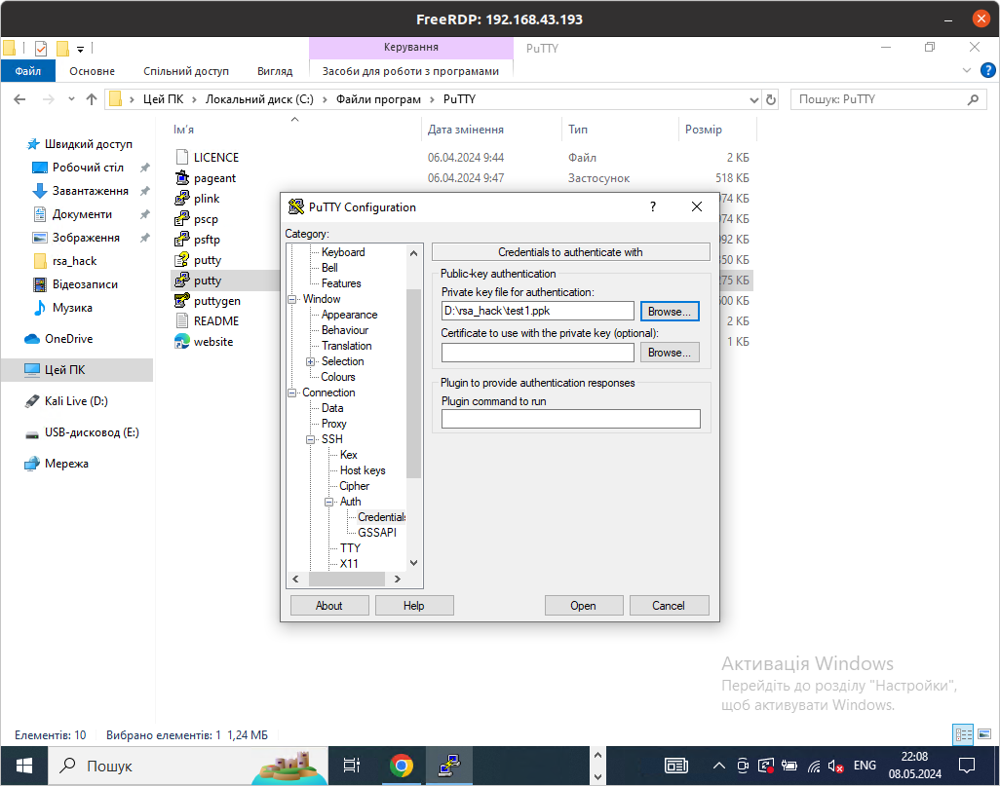
9. Далі воджу логін azureuser і ми підключені до віртуальної машини.

# Як створити віртуальну машину azure
1. Переходжу на портал [azure](https://portal.azure.com/#view/HubsExtension/BrowseResource/resourceType/Microsoft.Compute%2FVirtualMachines)
2. Натискаю кнопку create, далі натискаю "Azure virtual machine"
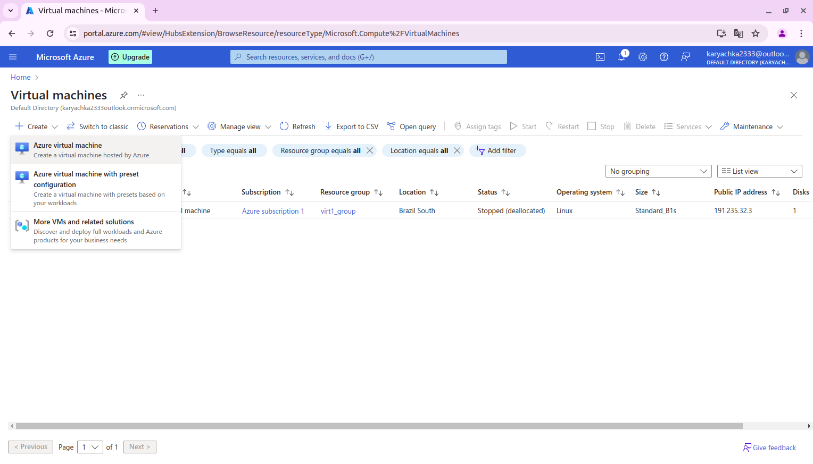
3. Далі вписую ім'я віртуальної машини в моєму випадку "virt2"
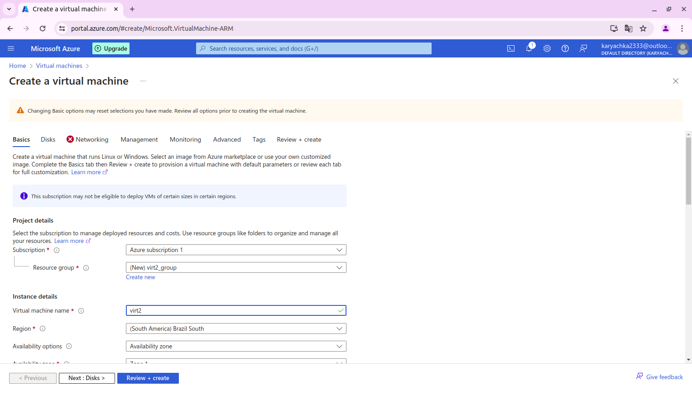
4. Далі натискаю "review+create"

5. Далі azure пропонує згенерувати пару ключів ssh, погоджуємось і завантажуємо

6. Тепер чекаємо поки не з'явиться повідомлення нижче і натискаємо "Go to resource"
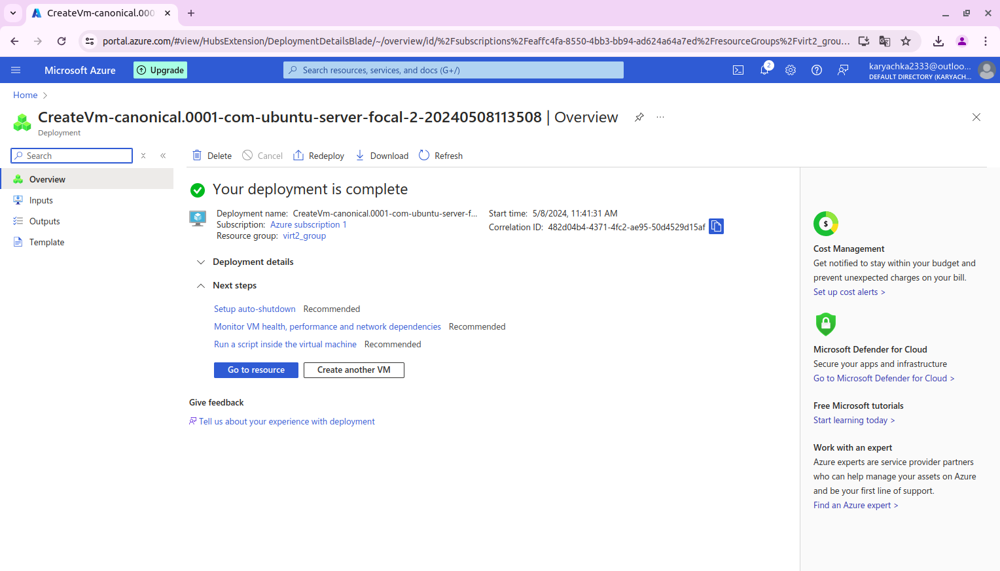
Далі йдемо по інструкції як підключитись по ssh за допомогою putty.
