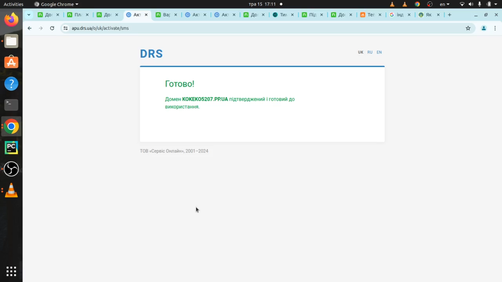

# Реєстрація та отримання безкоштовного домену nic.ua
NIC.UA пропонує можливість зареєструвати безкоштовне доменне ім'я у зоні .pp.ua. Ця пропозиція дозволяє користувачам скористатися послугами NIC.UA без додаткових витрат, що є чудовою можливістю для новачків або тих, хто хоче спробувати їхні послуги.
(Взагалі з карти одну гривню спишуть і не повернуть але що є то є.)

#### 1 Реєстрація акаунту в nic.ua
Переходимо за [посиланням](https://nic.ua/uk/signup), вводимо пошту, вигадуємо пароль,
тиснемо "Зареєструватись". Після цього ми маємо опинитись в панелі керування.

#### 2 Реєстрація доменого імені pp.ua
Спершу переходимо за [посиланням](https://nic.ua/uk) і бачимо картину нижче.
в поле "Введіть один чи кілька доменів" вбиваємо придумане ім'я, в моєму випадку це kokeko5207.pp.ua.
(Ваша назва обов'язково повинна закінчуватись на pp.ua) Якщо домен доступний для реєстрації,
то тиснемо на зелені кнопочки "В кошик", "Оформити замовлення", "Далі".

###### 2.1 Вводимо особисті дані
В мене є таке відчуття що сайт не особливо прискіпливий до даних які в нього вводять.
Тому тут можна проявити творчість і ввести рандомні дані (крім пошти та номеру).
Тикаємо на зелені кнопочки поки знову не з'явиться панель керування.

###### 2.2 Підтвердження електронної адреси
Переходимо на поштову скриньку електронної адреси яку вказували при реєстрації і тикаємо на зелену кнопочку.
Далі в панелі керування вибираємо вкладку домени, ви маєте побачити результат який зображений нижче, якщо ні
і ви дійсно підтвердили пошту, просто зачекайте. (Можливо прийде ще одне повідомлення де потрібно підтвердити пошту)

#### 3 Підключення картки
Переходимо на вкладку "Платіжні картки", натискаємо "додати картку", та
вводимо дані карти (на ній повинна бути 1 гривня і її ніхто не поверне). Рекомендую
просто створити карту для реєстрації в azure і тут, після чого видалити її.
Нижче показано як виглядає це вікно.

Далі тиснемо "Повернутись на сайт" де маємо побачити нашу картку.

Тепер переходимо на вкладку домени і чекаємо не побачимо наступне.

#### 4 Активація домену
Натисніть на слово "активація" і вас перенесе на статтю про способи та кроки,
як пройти активацію. Ми маємо отримати повідомлення показане нижче.

Ще трохи почекавши ми маємо побачити таку картину що забражена нижче, це
означатиме що залишається налаштувати сервер імен і ми матимемо типу сайт з http
з'єднанням.

