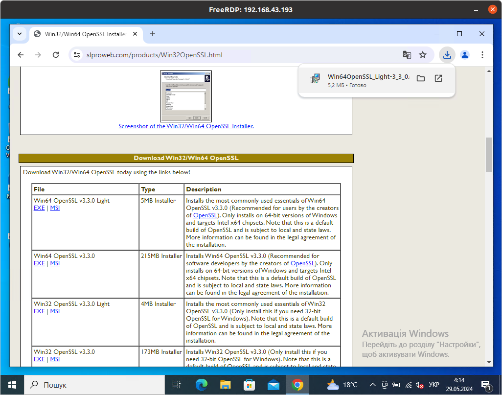
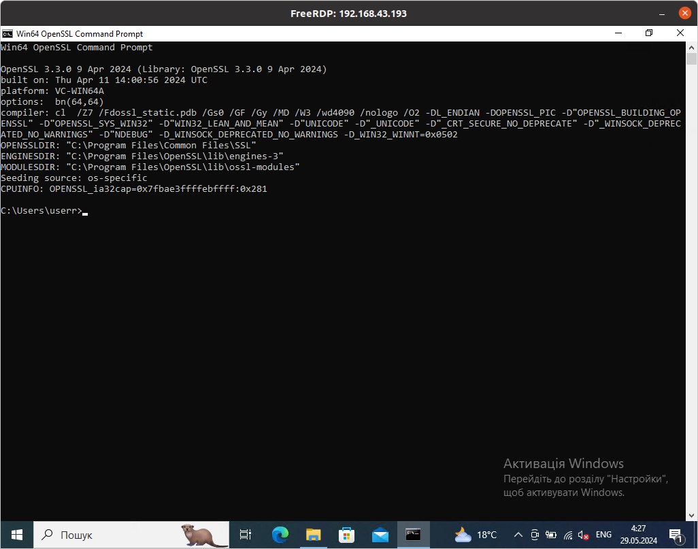
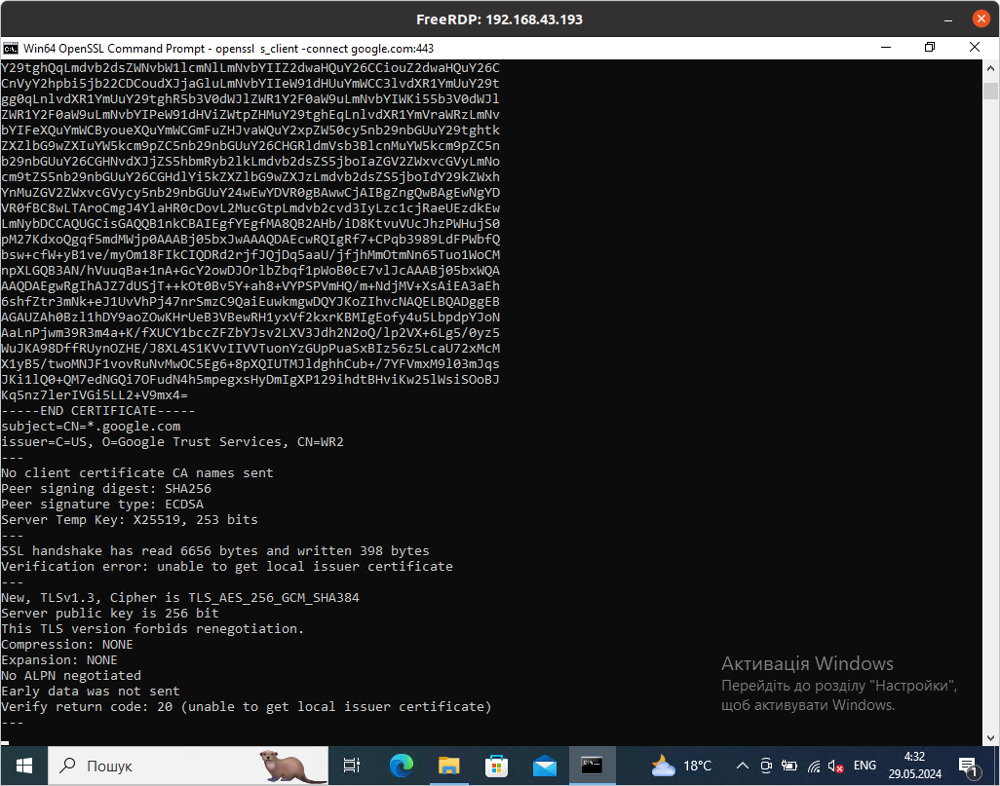
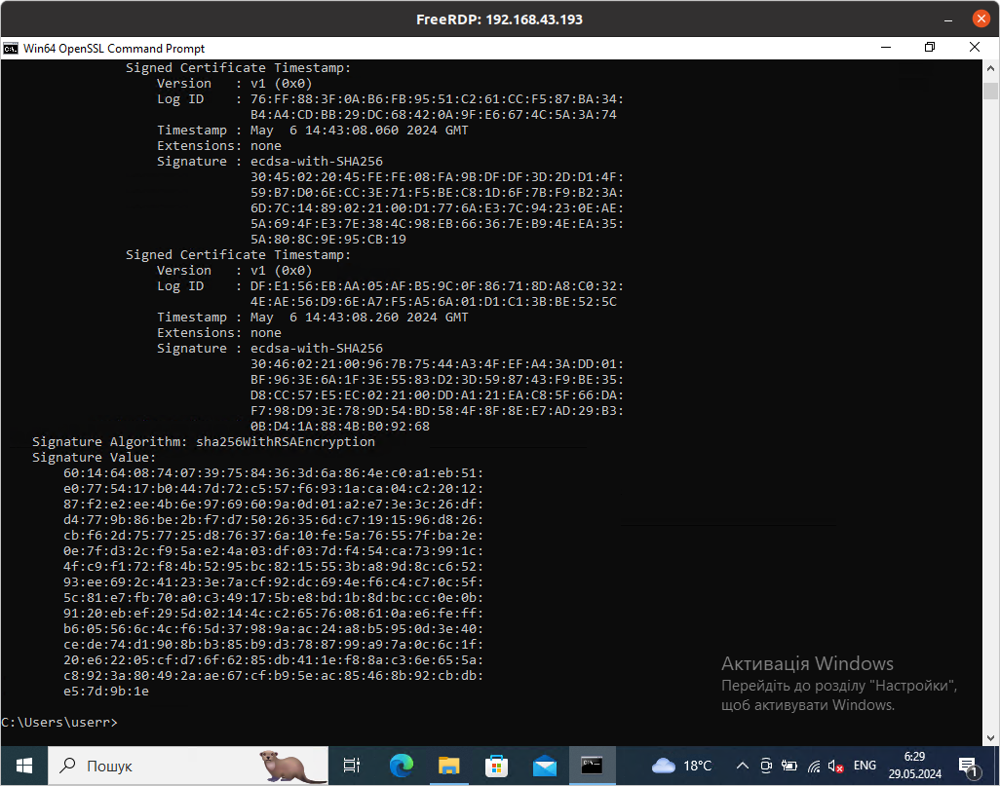

# Робота з openssl в віндовс
#### 1 Завантаження та встановлення
Переходимо на [сайт](https://slproweb.com/products/Win32OpenSSL.html),
і завантажуємо програму (я обрав лайт версію). Далі саме звичайне встановлення
самої звичайної програми.


Тепер переходимо в каталог з програмою в стандартному випадку це "C:\Program Files\OpenSSL-Win64\start".
І відкриваємо цю програму. Ми маємо побачити термінал.


#### 2 Робота в терміналі
Першою командою для прикладу я перегляну інформацію про сертифікат гугла
```
openssl s_client -connect google.com:443
```
Отримую такий результат:

Щоб ввести іншу команду потрібно натиснути комбінацію клавіш "Ctrl+C".

#### 3 Команди
Тут розглянуті меншість команд які доступні 

1 Щоб переглянути інформацію про сертифікат веб-сайту 

Завантажуємо сертифікат під назвою cert1.pem
```
openssl s_client -connect google.com:443 -showcerts > cert1.pem
```
Відкриваємо завантажений сертифікат
```
openssl x509 -text -noout -in cert1.pem
```
Отримуємо такий результат:


2 Щоб згенерувати самопідписаний сертифікат

Почнемо з закритого ключа, скористайтеся такою командою, щоб створити закритий ключ:
```
openssl genrsa -out my_private_key.key 2048
```
Тепер, коли у вас є закритий ключ, створіть із ним відкритий ключ:
```
openssl rsa -in my_private_key.key -pubout > my_public_key.pub
```
Використовуйте команду нижче, щоб створити свій сертифікат:
```
openssl req -x509 -new -key my_private_key.key -days 365 -out mycert.pem
```
Далі потрібно ввести дані сертифікату, почергово, слідуючи підсказкам (вони англійською).

