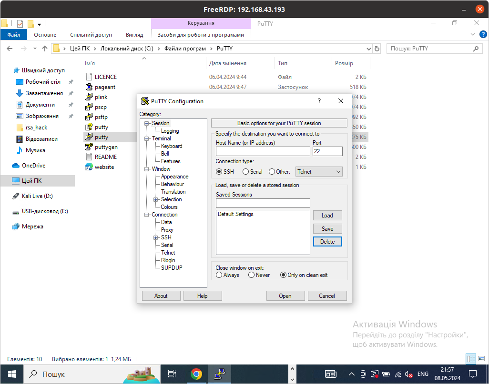

# Як підключитись до віртуальної машини по ssh
Спочатку я підключався через ключ ssh через термінал, тепер я опишу як підключитись через
putty в windows. Завантажую putty з офіційного [сайту], я передумав по побачив
вбудований ssh в powershell. Переходжу на портал azure. Знову передумав бо вилітали помилки.
Я завантажив putty з розширенням .msi. Першим кроком треба зайти в шлях
де встановленно программу. потім ми побачимо декілька програм ми відкриваємо щось
з keygen, щоб змінити формат приватного ключа з pem на ppk, 
зберігаємо файл в новому розширенні. Тепер відкриваю программу putty, після
введення айпі, переходжу в connections, ssh, auth, і перше верхнє там є
поле для введення там воно саме верхнє натискаю browse, і вибираю потрібний
раніше створений ppk файл. Потім як логін вводжу "azureuser", і помилок не
виникло на цьому все. Зараз розпишу покрокову інструкцію.
1. Завантажую putty з [офіційного сайту](https://www.chiark.greenend.org.uk/~sgtatham/putty/latest.html),
потрібно завантажити пакет з розширенням .msi

2. Встановити і запам'ятати шлях до програми, перейти в каталог де була встановлена,
программа, для мене це "C:\Program Files\PuTTY". Ви маєте побачити цей набір программ:

3. Буду вважати що ви вже отримали приватний ключ від віртуалки,
то відкриваємо програму "puttygen" і натискаємо кнопку "Load":

4. Тепер обираємо наш приватний ключ і з'явится ось таке повідомлення:

5. Натискаю ок і потім "Save private key".
6. Закриваю цю програму та відкриваю іншу з назвою "putty" (увімкніть віртуалку):

7. В "Host Name" і "Saved Sessions", вводжу айпі адресу віртуальної машини.
8. Тепер по ієрархії спускаюсь до потрібного параметру:
Connections->SSH->Auth->Credentials. Знаходимо параметр "Private key file for authentication",
тисну "Browse" і додаю раніше збережений ключ .ppk

9. Далі воджу логін azureuser і ми підключені до віртуальної машини.

Після підключення потрібно налаштувати [certbot](certbot.md)
